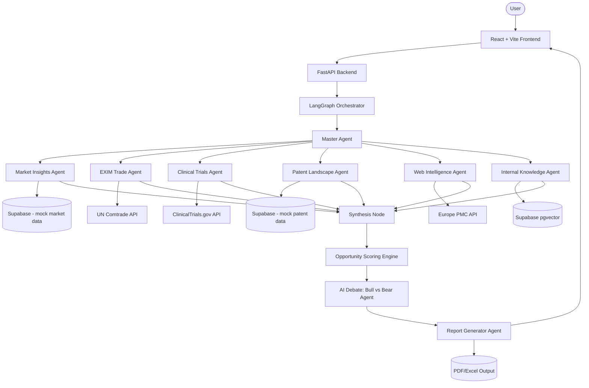
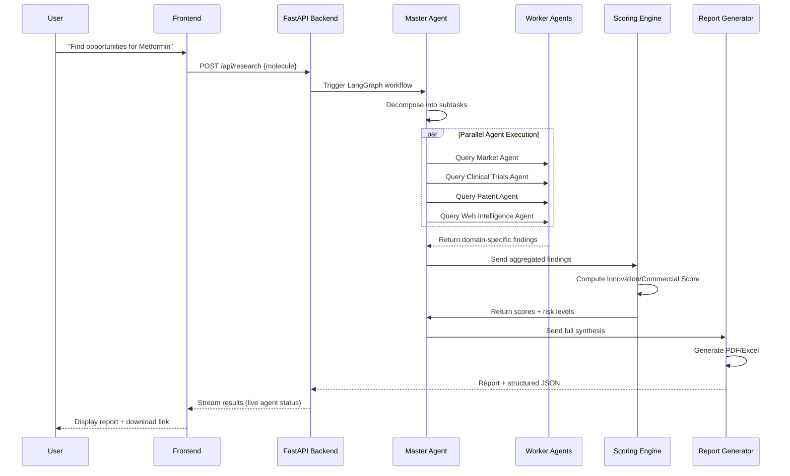

# MoleculeIQ — AI-Powered Molecule Intelligence Platform
### Complete Engineering Blueprint & Build Roadmap

---

## 1. Problem Statement

Pharmaceutical companies that manufacture generic drugs often want to diversify into **value-added / innovative products** — repurposing molecules they already know how to manufacture, into new formulations, new indications, or new markets.

To decide whether a molecule is "worth investing in," a research team currently has to manually check:

- Is there an **unmet medical need** for this molecule in a new form/indication?
- What does the **market** look like (size, growth, competitors)?
- What is the **patent situation** — is the molecule still under patent protection anywhere, or is it free-to-operate?
- What is the **clinical trial landscape** — is anyone already researching this repurposing?
- What do **regulatory bodies and journals** say about it?

Doing this manually across regulatory sites, patent databases, clinical trial registries, and market reports takes **weeks to months** per molecule, and pharma companies evaluate **hundreds** of molecules.

**MoleculeIQ automates this entire research pipeline** using a multi-agent AI system: a user asks about a molecule in plain English, and specialized AI agents research different domains in parallel, then synthesize everything into a single evidence-backed report with an AI-generated recommendation — cutting the process from months to minutes.

### Why This Product Exists
- Manual research is slow, repetitive, and inconsistent between analysts.
- Data lives in silos (patents, clinical trials, trade data, market reports) — nobody looks at all of it together.
- Decision-makers don't have time to read 40-page reports; they want a **score and a recommendation**, backed by evidence they can drill into.

### Who Would Use / Pay For This
- **R&D / Innovation teams** — deciding which molecules to invest research budget in.
- **Business Analysts / Commercial Strategy** — sizing the market opportunity.
- **Medical Affairs** — understanding unmet need and clinical landscape.
- **Leadership (CEO/VP level)** — comparing multiple molecules side-by-side to allocate portfolio budget.

---

## 2. User Personas

| Persona | Goal | What They Care About |
|---|---|---|
| **R&D Scientist** | Find scientifically valid repurposing opportunities | Clinical trial data, unmet need, mechanism of action |
| **Business Analyst** | Size the commercial opportunity | Market size, CAGR, competitor landscape |
| **Patent/IP Analyst** | Check freedom-to-operate | Patent expiry dates, jurisdiction-wise filings |
| **Commercial Strategy Lead** | Decide where to invest | Final score, ROI potential, risk level |
| **Leadership (CXO)** | Compare molecules at a glance | One-line recommendation, not a 40-page PDF |

---

## 3. Core Product Scope (What You Are Actually Building)

To keep this buildable solo in a realistic timeframe, the scope is deliberately focused:

**7 Research Agents (data-gathering layer):**
1. Master Agent (Orchestrator)
2. Market Insights Agent *(mock dataset, framed as "Market Intelligence")*
3. Trade/EXIM Agent (real data — UN Comtrade API)
4. Clinical Trials Agent (real data — ClinicalTrials.gov API)
5. Patent Landscape Agent *(mock dataset)*
6. Web Intelligence Agent (real data — Europe PMC API)
7. Internal Knowledge Agent (RAG over uploaded documents)
8. Report Generator Agent (PDF/Excel output)

**3 Differentiator Features (the "wow" layer, built on top):**
1. **AI Opportunity Scoring Engine** — final Innovation Score, Commercial Score, Risk ratings
2. **Explainability Layer** — every claim shows its source + confidence %
3. **AI Debate** — two agents argue "Invest" vs "Don't Invest," Master Agent gives final verdict

This gives a complete, demoable, defensible story: *research → synthesize → score → explain → debate → decide.*

---

## 4. Complete Tech Stack (Zero-Cost)

| Layer | Technology | Why |
|---|---|---|
| Frontend | React + Vite + Tailwind CSS | Fast dev experience, modern chat-style UI, free |
| Backend | FastAPI (Python) | Async, fast, great for streaming agent responses |
| Agent Orchestration | LangGraph | Purpose-built for multi-agent workflows with state |
| LLM | Groq API (Llama 3.x) or Gemini free tier | Free, fast inference, OpenAI-SDK-compatible |
| Database | Supabase (PostgreSQL, free tier) | Mock structured data (market/patent tables) + storage |
| Vector Store | Supabase pgvector (free) | For Internal Knowledge Agent (RAG) |
| Clinical Data | ClinicalTrials.gov API | Free, no key required |
| Trade Data | UN Comtrade API | Free, public |
| Literature Data | Europe PMC REST API | Free, no key required |
| PDF/Excel Reports | ReportLab / openpyxl | Free, open-source |
| Hosting (optional) | Vercel (frontend) + Render/Railway free tier (backend) | Free tier deployable demo |

**Total cost: ₹0.** Every component has a free tier or is fully open-source.

---

## 5. System Architecture



### Agent Roles Explained

| Agent | Purpose | Output |
|---|---|---|
| **Master Agent** | Breaks user query into subtasks, assigns to workers, aggregates results | Task plan + final synthesis |
| **Market Insights Agent** | Market size, growth trends, competitor presence | Tables/charts of market data |
| **EXIM Trade Agent** | Import/export volumes, sourcing dependency | Trade trend data |
| **Clinical Trials Agent** | Active trials, phase distribution, sponsors | Trial landscape summary |
| **Patent Landscape Agent** | Patent status, expiry timelines, jurisdictions | Freedom-to-operate assessment |
| **Web Intelligence Agent** | Recent journal articles, guideline updates | Cited literature snippets |
| **Internal Knowledge Agent** | Answers from uploaded internal docs (RAG) | Evidence-backed internal summary |
| **Scoring Engine** | Converts all findings into numeric scores | Innovation/Commercial score, risk levels |
| **Debate Agents** | Argue for/against investment using the evidence | Two-sided argument + verdict |
| **Report Generator** | Compiles everything into downloadable report | PDF/Excel |

---

## 6. Request Flow (Sequence Diagram)



---

## 7. Database Schema (Supabase / PostgreSQL)

```
molecules
├── id (PK)
├── name
├── created_at

research_sessions
├── id (PK)
├── molecule_id (FK → molecules)
├── user_query
├── status (pending/running/complete)
├── created_at

iqvia_sales (mock market data)
├── id (PK)
├── molecule_id (FK)
├── year
├── market_size_usd
├── cagr_percent
├── region

patents (mock patent data)
├── id (PK)
├── molecule_id (FK)
├── jurisdiction
├── filing_date
├── expiry_date
├── status

clinical_trials_cache
├── id (PK)
├── molecule_id (FK)
├── trial_id
├── phase
├── sponsor
├── status

reports
├── id (PK)
├── session_id (FK → research_sessions)
├── innovation_score
├── commercial_score
├── patent_risk
├── clinical_risk
├── recommendation
├── pdf_url
├── created_at

documents (Internal Knowledge Agent)
├── id (PK)
├── filename
├── content_embedding (vector)
├── metadata (jsonb)
```

**Why these tables:** every table maps directly to one agent's output, so results can be cached (avoiding repeated API calls) and reused for the "Research Memory" style features later if you extend the project.

---

## 8. The 3 Differentiator Features — How They Work

### 8.1 AI Opportunity Scoring Engine
After all worker agents return findings, one final LLM call receives the **combined structured findings** (not raw text) and is prompted to output strict JSON:
```json
{
  "innovation_score": 91,
  "commercial_score": 88,
  "patent_risk": "Low",
  "clinical_risk": "Medium",
  "market_attractiveness": "High",
  "recommendation": "Strong Candidate"
}
```
This is rendered as a scorecard at the top of the report — no new data source needed, just a synthesis prompt.

### 8.2 Explainability Layer
Every agent, when returning findings, must also return a `source` field (API name/URL) and a `confidence` estimate. The frontend renders each claim with a small citation badge and a confidence percentage — reusing data the agents already fetch.

### 8.3 AI Debate
Two additional LangGraph nodes run **after** synthesis:
- `Agent A (Bull)` — prompted to argue *for* investment using only supporting evidence
- `Agent B (Bear)` — prompted to argue *against* using only risk evidence
- `Master Agent` — reads both arguments and gives a final verdict with reasoning

This is a pure prompting/orchestration feature — no new infrastructure required.

---

## 9. Week-by-Week Roadmap (4 Weeks)

### Week 1 — Foundation
- Set up FastAPI backend + React/Vite frontend skeleton
- Set up Supabase project, create mock `iqvia_sales` and `patents` tables with sample CSV data
- Get **one** agent fully working end-to-end (recommend: Clinical Trials Agent, since API is free and simple)
- Basic LangGraph setup with a single-node graph

### Week 2 — Core Agents
- Add Market Insights, Patent Landscape, EXIM Trade, Web Intelligence agents
- Build Master Agent orchestration logic (task decomposition + parallel calls)
- Test each agent independently before wiring into the graph

### Week 3 — Differentiators + Report
- Build Opportunity Scoring Engine (synthesis prompt)
- Build Explainability rendering (source + confidence in UI)
- Build AI Debate nodes
- Build Report Generator Agent (PDF via ReportLab)

### Week 4 — Polish & Demo Prep
- Frontend: chat interface, live agent status indicators, charts/tables
- Internal Knowledge Agent (RAG) — lowest priority, add if time permits
- End-to-end testing with 3–4 sample molecules
- Prepare demo script + deploy free-tier hosting (optional)
- Prepare interview explanation (see Section 10)

---

## 10. Interview Preparation

**How to explain it in one line:**
> "MoleculeIQ is a multi-agent AI system that automates pharmaceutical molecule research — it orchestrates specialized agents to gather market, patent, and clinical data in parallel, then uses AI to score, explain, and even debate whether a molecule is worth investing in."

**Expect these questions — have answers ready:**
1. *"Why LangGraph and not just sequential function calls?"* → Explain parallel execution, state management, and easier extensibility (adding a new agent = adding a new node).
2. *"How do you prevent hallucination in the report?"* → Explain the explainability layer — every claim is tied to a source, and agents are prompted to only state what's in retrieved data.
3. *"Why mock data for IQVIA/patents?"* → Be honest: real IQVIA is an enterprise paid subscription; you replicated the *pattern* using representative data, and the architecture is designed to plug in the real API in production.
4. *"How would this scale to production?"* → Mention caching (avoid re-fetching same molecule data), background job queues for long-running research, and rate-limit handling for free APIs.
5. *"What was the hardest part?"* → Be ready to genuinely describe a real debugging story (LangGraph state passing, prompt engineering for structured JSON output, etc.) — pick whichever you actually struggled with.

---

## 11. Scope Discipline — What NOT to Add

Skip these (discussed and deprioritized for time reasons): Competitor Monitoring (needs background jobs), Research Memory (diffing complexity), Portfolio Recommendation across 100 molecules (too many API calls), Simulation/What-if engine, Cost Estimation (fake numbers are easily challenged), Team Collaboration features (not AI-related, low interview value).

If time remains after Week 4, **Research Memory** is the next best addition since it reuses the same database tables you already built.

---

*This document is your build reference — update it as you go so it stays accurate to what you actually built (important for interview credibility).*