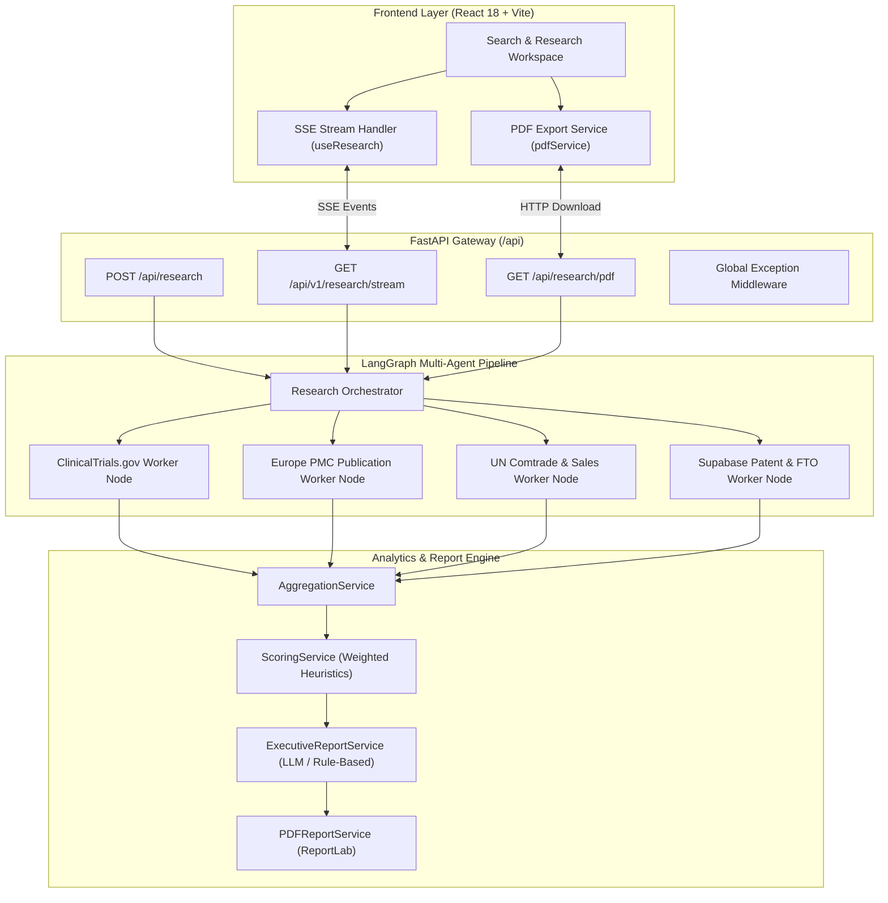

# MoleculeIQ — Pharmaceutical Innovation Intelligence Platform

> **Production-Grade AI SaaS Platform for Commercial Opportunity Evaluation, Clinical Evidence Aggregation, Patent Landscape Analysis, and C-Suite Executive Report Generation.**

---

## 🌟 Executive Overview

**MoleculeIQ** is an enterprise-grade pharmaceutical intelligence workspace designed to accelerate drug repurposing, portfolio benchmarking, and investment due diligence. By orchestrating multi-agent research pipelines across real-world clinical, academic, market, and intellectual property repositories, MoleculeIQ synthesizes heterogeneous data into deterministic opportunity scores and McKinsey/BCG-style executive reports in seconds.

---

## 🏗️ System Architecture



---

## ⚡ Key Capabilities & Technical Features

- **Multi-Agent Parallel Research**: Asynchronously gathers data across ClinicalTrials.gov API v2, Europe PMC REST API, UN Comtrade API, and Supabase database.
- **Deterministic Commercial Opportunity Scoring**: Multi-domain weighted heuristic algorithm yielding a composite 0–100 score and data confidence rating.
- **Real-Time Pipeline SSE Streaming**: Deterministic Server-Sent Events delivering pipeline progress updates to the UI in real time.
- **C-Suite Executive Report Workspace**: Deloitte/McKinsey-style executive reading workspace with smooth table of contents scrolling and max-width readable typography.
- **ReportLab PDF Export**: Production-grade C-suite PDF document rendering generated server-side.

---

## 🛠️ Technology Stack

| Layer | Technologies Used |
| :--- | :--- |
| **Frontend** | React 18, Vite, JavaScript (ES6+), Tailwind CSS, Lucide Icons, Axios |
| **Backend** | Python 3.11+, FastAPI, Uvicorn, LangGraph, Pydantic, HTTPX, ReportLab |
| **External APIs** | ClinicalTrials.gov REST API v2, Europe PMC REST API, UN Comtrade API |
| **Database** | Supabase (PostgreSQL) for patent landscape & commercial datasets |
| **AI / LLM** | Google Gemini API (gemini-2.5-flash) with deterministic rule-based fallback synthesizer |

---

## 🔌 API Endpoints & Contracts

### 1. Research Pipeline (REST)
`POST /api/research`
```json
// Request Body
{
  "molecule_name": "Metformin"
}

// Response: ResearchContext JSON payload with metadata & score
```

### 2. Pipeline SSE Stream (SSE)
`GET /api/v1/research/stream?molecule_name=Metformin`
- Emits real-time event notifications (`research_started`, `clinical_completed`, `literature_completed`, `market_completed`, `patent_completed`, `scoring_completed`, `research_completed`).

### 3. Executive PDF Report Export
`GET /api/research/pdf?molecule_name=Metformin`
- Returns binary `application/pdf` download stream with `Content-Disposition` attachment header.

---

## 🚀 Quickstart & Local Setup

### 1. Backend Setup

```bash
cd backend
python -m venv venv
# On Windows PowerShell:
.\venv\Scripts\Activate.ps1
# On macOS/Linux:
# source venv/bin/activate

pip install -r requirements.txt
uvicorn app.main:app --host 127.0.0.1 --port 8000 --reload
```
*Backend API docs available at `http://127.0.0.1:8000/docs`.*

### 2. Frontend Setup

```bash
cd frontend
npm install
npm run dev
```
*Frontend dev server will launch at `http://localhost:5173`.*

---

## 💡 Portfolio & Technical Interview Highlights

1. **Why LangGraph for Agentic Orchestration?**  
   Provides stateful graph execution with strict state transitions, ensuring deterministic node execution order and reliable fallback handling when individual data sources fail.

2. **Server-Sent Events (SSE) vs WebSockets**:  
   SSE was chosen over WebSockets because research execution is a uni-directional stream from backend to client. SSE runs over standard HTTP, simplifying proxy configuration, load balancing, and connection lifecycle management.

3. **Deterministic Scoring Architecture**:  
   Commercial opportunity scores are computed deterministically based on empirical domain criteria (trial recruitment status, publication citations, market size, and FTO patent risk), avoiding non-deterministic LLM hallucination in quantitative scoring.

---

## 📜 License & Author

- **Author**: Priyanshu Raj
- **Project**: MoleculeIQ Pharmaceutical Research Intelligence Platform
